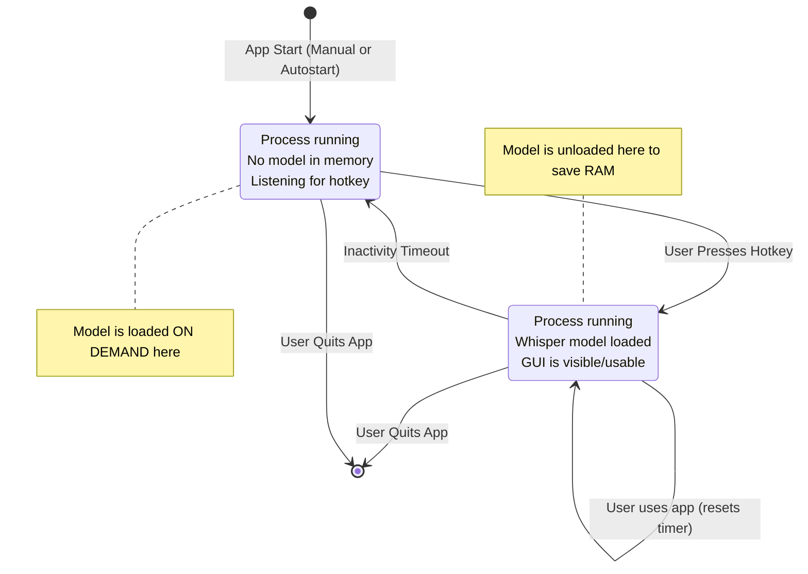

# W4L Architecture Overview: The On-Demand Hybrid Model

This document outlines the core architectural pattern for W4L, designed for high efficiency and a responsive user experience.

## The Problem

System tray utilities that use significant resources (like a large AI model) face a dilemma:
1.  **Load everything on startup**: This provides instant access but consumes a large amount of RAM constantly, which is unfriendly to the user's system.
2.  **Launch on demand**: This saves memory but introduces a significant delay (several seconds) each time the user wants to use the app, defeating the purpose of a "quick capture" tool.

## The Solution: On-Demand Hybrid Model

W4L solves this by implementing a hybrid model with two distinct states, allowing it to be both resource-efficient and highly responsive.

### State 1: Lightweight Standby Mode
This is the default state of the application.

- **Process State**: The `w4l` process is running in the background.
- **Memory Footprint**: **Very Low.** The large Whisper AI model is **NOT** loaded into memory.
- **Responsibilities**:
    - Show the system tray icon.
    - Run the global hotkey listener, waiting for user input.
    - Manage the single-instance lock to prevent duplicates.

### State 2: Active Mode
The application enters this state only when the user needs it.

- **Trigger**: The user presses the global hotkey.
- **Transition**:
    1. The application first checks if the Whisper model is loaded.
    2. If not, it loads the model into memory. This incurs a one-time delay for the first use after a long period of inactivity.
    3. The main GUI window is displayed.
- **Memory Footprint**: **High.** The Whisper model is now loaded in RAM.
- **Responsibilities**:
    - Provide the GUI for recording audio.
    - Perform transcription using the loaded model.
    - Reset an inactivity timer with each use.

### Transitioning Back to Standby

To conserve resources, the application will automatically transition back to "Lightweight Standby" mode after a configurable period of inactivity.

- **Trigger**: The inactivity timer expires.
- **Action**: The application unloads the Whisper model from memory, freeing up system RAM.
- **Result**: The app returns to its low-memory standby state, still listening for the next hotkey press.

## State Diagram

## Benefits of this Architecture

1.  **Memory Efficiency**: W4L can be an autostart application without bogging down the user's system with a constant high memory load.
2.  **Responsiveness**: For frequent use, the model remains loaded ("warm"), providing near-instant access. The only delay is on the first use after a long break.
3.  **Robustness**: This model requires a single, persistent process, which simplifies state and instance management. 