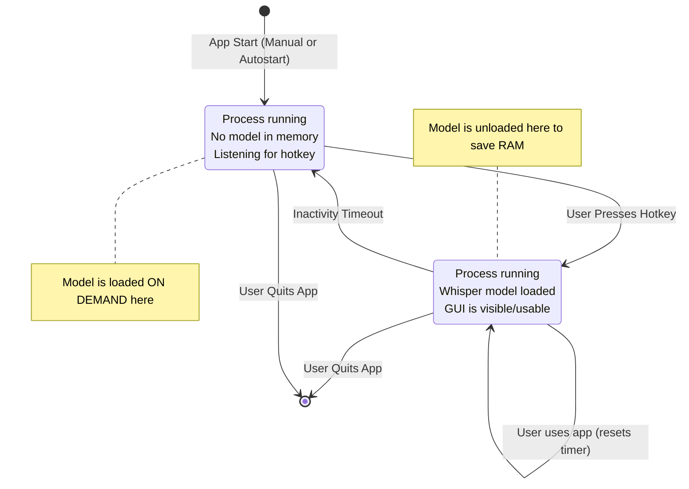

# W4L Architecture Overview: The On-Demand Hybrid Model

This document outlines the core architectural pattern for W4L, designed for high efficiency and a responsive user experience.

## The Problem

System tray utilities that use significant resources (like a large AI model) face a dilemma:
1.  **Load everything on startup**: This provides instant access but consumes a large amount of RAM constantly, which is unfriendly to the user's system.
2.  **Launch on demand**: This saves memory but introduces a significant delay (several seconds) each time the user wants to use the app, defeating the purpose of a "quick capture" tool.

## The Solution: On-Demand Hybrid Model

W4L solves this by implementing a hybrid model with two distinct states, allowing it to be both resource-efficient and highly responsive.

### State 1: Lightweight Standby Mode
This is the default state of the application.

- **Process State**: The `w4l` process is running in the background.
- **Memory Footprint**: **Very Low.** The large Whisper AI model is **NOT** loaded into memory.
- **Responsibilities**:
    - Show the system tray icon.
    - Run the global hotkey listener, waiting for user input.
    - Manage the single-instance lock to prevent duplicates.

### State 2: Active Mode
The application enters this state only when the user needs it.

- **Trigger**: The user presses the global hotkey.
- **Transition**:
    1. The application first checks if the Whisper model is loaded.
    2. If not, it loads the model into memory. This incurs a one-time delay for the first use after a long period of inactivity.
    3. The main GUI window is displayed.
- **Memory Footprint**: **High.** The Whisper model is now loaded in RAM.
- **Responsibilities**:
    - Provide the GUI for recording audio.
    - Perform transcription using the loaded model.
    - Reset an inactivity timer with each use.

### Transitioning Back to Standby

To conserve resources, the application will automatically transition back to "Lightweight Standby" mode after a configurable period of inactivity.

- **Trigger**: The inactivity timer expires.
- **Action**: The application unloads the Whisper model from memory, freeing up system RAM.
- **Result**: The app returns to its low-memory standby state, still listening for the next hotkey press.

## State Diagram

## Benefits of this Architecture

1.  **Memory Efficiency**: W4L can be an autostart application without bogging down the user's system with a constant high memory load.
2.  **Responsiveness**: For frequent use, the model remains loaded ("warm"), providing near-instant access. The only delay is on the first use after a long break.
3.  **Robustness**: This model requires a single, persistent process, which simplifies state and instance management.

## Model Metadata Refresh Logic and UI Interaction

### Refresh Points
- **First app run (or if model_metadata.json is missing):**
  - Fetch the full list of official models and their metadata (checksum, size) from online.
  - For each model, check if the file exists and matches the checksum. Set status to 'downloaded', 'corrupted', or 'not_downloaded'.
  - Save this as the initial model_metadata.json.
  - Set `last_refreshed` to now, `next_update` to now + update_interval_days.

- **Subsequent app runs (metadata exists):**
  - Only consult the local model_metadata.json (no online fetch).
  - For each model, check the physical file and update status as above.
  - Do not update checksums or sizes from online unless the user requests a refresh.

- **Manual refresh (user clicks 'Refresh models' in the settings UI):**
  - Fetch the latest model list and metadata online.
  - Update model_metadata.json with new checksums/sizes.
  - Update statuses as above.
  - Update the 'last refreshed' date and display it in the UI.

- **Scheduled background refresh (when next_update is reached):**
  - Same as manual refresh, but triggered by the app if the date is reached.

### UI Interaction
- The 'Models' tab in the settings dialog includes a 'Refresh models' button and a 'Last refreshed' label.
- When the user clicks 'Refresh models', the app fetches the latest model metadata online, updates the metadata file, and updates the UI.
- The 'Last refreshed' label always shows the last time the metadata was refreshed (either manually or automatically).
- The model list in the UI is always populated from the current metadata file, and statuses are updated based on the actual files on disk.

### Metadata Fields
- `last_refreshed`: The last time the model metadata was refreshed (ISO8601 UTC string).
- `next_update`: The next scheduled time for a background refresh (ISO8601 UTC string).
- `update_interval_days`: The interval (in days) between scheduled background refreshes.
- `models`: Dictionary of all official models, each with:
  - `name`: Model name
  - `current_checksum`: Latest known checksum
  - `current_size`: Latest known size (bytes)
  - `status`: 'downloaded', 'corrupted', or 'not_downloaded'
  - `history`: List of previous downloads/updates

### Summary Table

| Event                        | Online Fetch? | Update Metadata? | Update Status? | Show Last Refreshed? |
|------------------------------|:-------------:|:----------------:|:--------------:|:--------------------:|
| First app run (no metadata)  |      Yes      |       Yes        |      Yes       |         Yes          |
| App run (metadata exists)    |      No       |       Yes        |      Yes       |         Yes          |
| User clicks Refresh          |      Yes      |       Yes        |      Yes       |         Yes          |
| Scheduled background refresh |      Yes      |       Yes        |      Yes       |         Yes          |

</rewritten_file> 